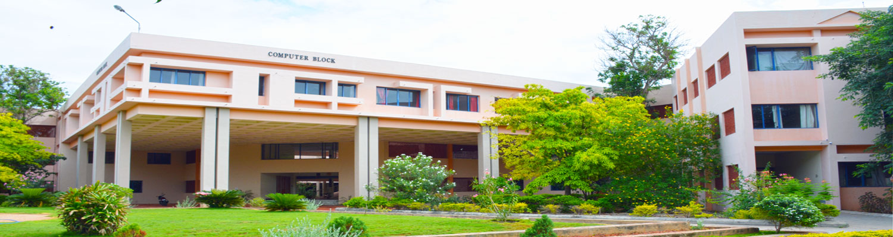

   Artificial Intelligence and Data Science 

Department of Artificial Intelligence and Data Science
======================================================

Department Profile

The Department of Artificial Intelligence and Data Science was established in the year 2020 with the aim of imparting balanced technical education with a holistic approach. The department is fully committed to develop and transform the students as experts in cross-cutting applications that can be co-evolved with AI while solving domain specific challenges. The department is well equipped with state-of-the-art infrastructure to empower the students with the recent technical know-how’s.

* * *

  

VISION

MISSION

"To emerge as a centre of excellence in the domain of Artificial Intelligence and Data Science technologies with excellence in research, education, and innovation in order to serve the nation"

"To produce decorated technocrats with Artificial Intelligence and Data Science competence ready for solving collaborative, ethical, social, domain and research specific challenges in order to build the community and transform the nation"