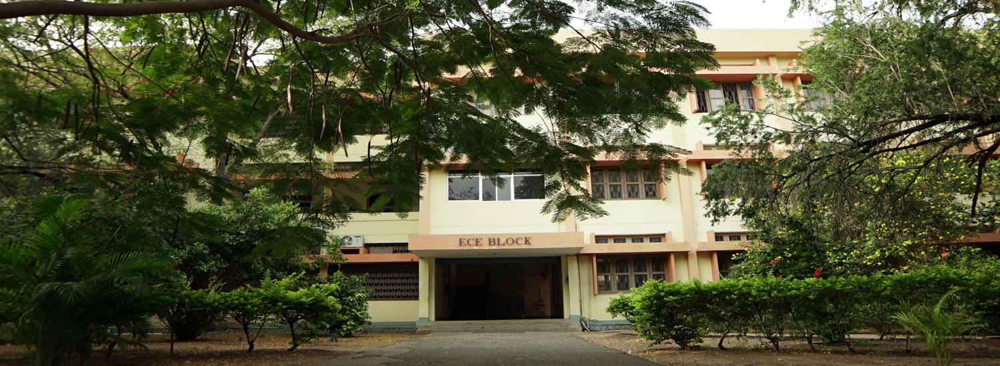

   Bio Medical 

Department of Bio Medical Engineering
=====================================

  

VISION

MISSION

"To be pioneers in transfer of biomedical engineering research into applications that will enhance the development of clinical care devices/systems and biomedical engineering to meet the global challenges by moulding engineers to contribute to the society with ethics."

"To train the biomedical engineers to develop clinically adaptable solutions for human health by facilitating the integration of science, engineering, and medicine and to prepare our graduates for a career at the interface between engineering and biomedical science brimming with skill and ethics in corporate / professional / academic communities."