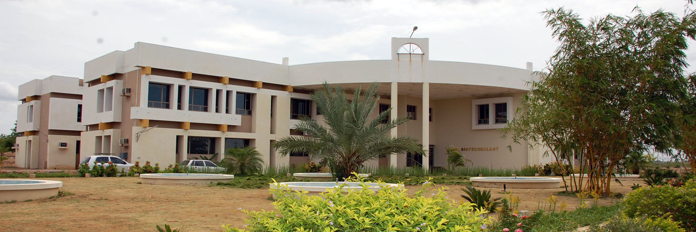

   Bio Technology 

Department of BioTechnology
===========================

Department Profile

The Department of Biotechnology was established in the year 2002 by offering B.Tech Biotechnology program. The department also offers M.Tech Biotechnology, part-time and full-time Ph.D programs in Biotechnology. The B.Tech program conferred with accreditation from NBA, New Delhi under Tier I category. The department has specialized faculty in the areas of Molecular Biology, Genetic Engineering, Bioprocess and Chemical Engineering, Nanobiotechnology, Microbial Technology and Computational Biology. The excellent performance by our students in GATE, CSIR and other All-India competitive examinations has placed them in industries like Biocon, Saksin Life Sciences, GE Healthcare, etc., and premier institutions like IITs in India and Universities abroad. The department houses state of the art genomic and proteomic facility, fermentation unit, plant and animal tissue culture facility, radioactive laboratory, animal house with approvals from government agencies like Department of Biotechnology, New Delhi, Atomic Energy Regulatory Board (AERB), Mumbai and Committee for the Purpose of Control and Supervision of Experiments (CPCSEA), Ministry of Forests and Environment, New Delhi.

Vision and Mission

VISION

MISSION

*   Impart strong theoretical background in the fundamental concepts of Biology and Chemical Engineering
*   Train students to be methodical and systematic to pursue laboratory experiments with utmost care and purpose
*   Expose students to modern tools of Biotechnology research

*   To enable students to acquire specialized skills in core aspects of engineering and life sciences and apply them for the development of innovative technologies
*   To transform the department into a full-fledged research facility by developing modern infrastructure to pursue research in cutting edge areas of Biotechnology
*   To train students to realize enormous responsibility of being a biotechnologist to serve society taking cognizance of ethical and environmental responsibilities