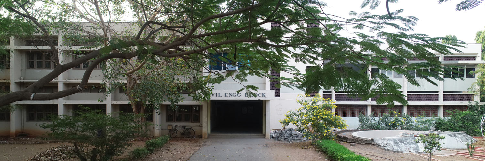

   Civil 

Department of Civil Engineering
===============================

Salient Features of our Department

*   Department of Civil Engineering received reaccreditation by National Board of Accreditation (NBA), AICTE, New Delhi, for two years under TIER-I, from 01-06-2015 for B.E Civil Engineering.
*   M.E. Structural Engineering PG Programme is accredited by National Board of Accreditation (NBA), AICTE, New Delhi, for three years under TIER-I, upto 30-06-2024.
*   Recognized Research Centre of Anna University, Chennai for pursuing Ph.D. in Civil Engineering.
*   Doing research projects funded by various funding agencies.
*   Infrastructure to the worth of more than 2 Crores
*   Consultancy and commercial test assignments are being offered to various government agencies, private companies and to other institutes.
*   Our faculty are fellow members of renowned technical bodies.
*   UG and PG Programmes have got Permanent affiliation from Anna University, Chennai.
*   Secured "The Best Department of the year" award from Anna University, Chennai for the year 2002.
*   Secured “Best Institute Award” in CEAFEST technical festival conducted by IIT Madras, Chennai for five consecutive years (2004, 2005, 2006, 2007 & 2008).
*   Secured “Best Institute Award” in COLOSSUS '08 technical festival conducted by PSG College of Technology, Coimbatore.
*   Students bagged 177 University ranks including 18 first ranks from the inception.
*   Smart class rooms are available.
*   Wi-Fi enabled internet facilities are available in the department.
*   Value added courses such as AutoCAD, Total Station, Revit Architecture, Prima veera, Geo-spatial software applications are offered to students regularly.
*   Special courses on advanced topics catering to the requirement of Industry are arranged regularly to both UG and PG students.
*   Students are motivated to do Mini Projects to improve their practical knowledge.
*   Students are encouraged to undergo Internship under fast track scheme to improve their placement prospects.
*   Soft skill training programmes offered by reputed professional companies are arranged to enhance their communication and general aptitude skills.

* * *

  

VISION

"To serve the nation by providing a quality engineering education that enables students to enter a profession that can improve the civil infrastructure and economic welfare"

MISSION

"To provide students with a broad and thorough education in civil engineering fundamentals, applications and design that prepares them for the practice of civil engineering at the professional level with the confidence and skills necessary to meet the technical and social challenges of the future"