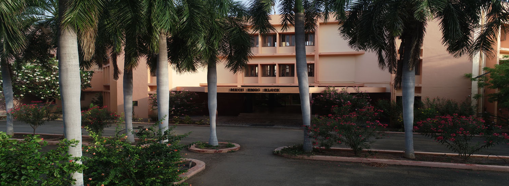

   Mechanical 

Department of Mechanical Engineering
====================================

Vision and Mission

VISION

MISSION

"To render services to the global needs of engineering industries by educating students to become professional mechanical engineers of excellent calibre”

“To produce mechanical engineering technocrats with a perfect knowledge of intellectual and hands on experiences and to inculcate the spirit of moral values and ethics to serve the society”

* * *

  

Salient Features of our Department

*   Department of Mechanical Engineering received accreditation further 3 years i.e. from 2018 - 19 to 2020 - 21 (Up to 30.06.2021) by National Board of Accreditation (NBA), AICTE, New Delhi for B.E Mechanical Engineering
*   Recognized as Research Centre by Anna University for pursuing Ph.D. and M.S. degree in Mechanical Engineering and Nano Science and Technology.
*   Recognized as Centre of Relevance and Excellence (CORE) on Industrial Safety by DST, TIFAC, and New Delhi.
*   The M.E. Industrial Safety Engineering course has been recognized by the Labour and Employment (M2) Department, Government of Tamilnadu, as a qualification for the post of Safety Officer.
*   Recognized as Technology Business Incubator (TBI) by MSME, New Delhi.
*   28 Sponsored Research Projects to the worth of Rs. 2.85 Crores.
*   Infrastructure to the worth of Rs.12.5 Crores.
*   Listed at [http://www.cirs-tm.org/](http://www.cirs-tm.org/), the International Centre for Scientific Research (CIRS) which is a well renowned website for science research under the category "Organisation / Technology / India" and IT Department under the category "Organisation / Computer Science / India".
*   Our faculty are fellow members of renowned national and international level technical bodies and have received recognition in the form of national awards.